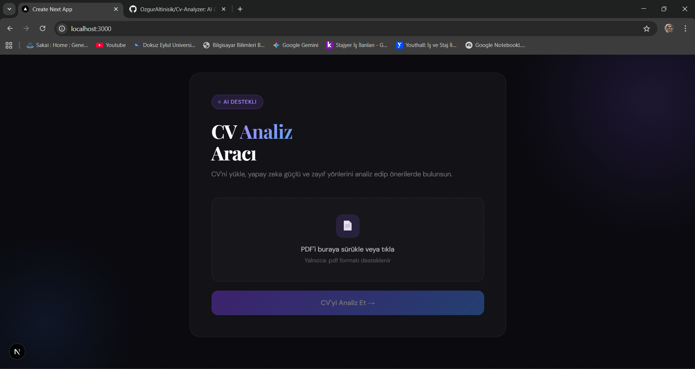
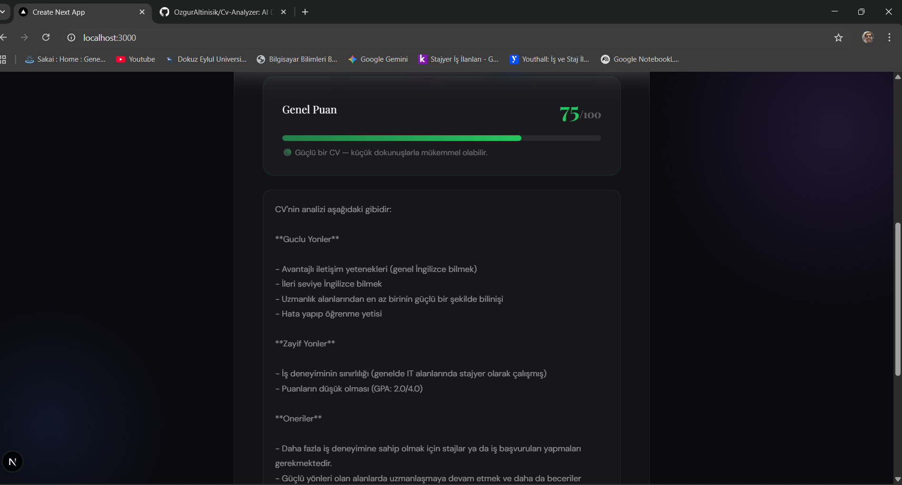

# CV Analiz Aracı 🤖

AI destekli CV analiz uygulaması. PDF formatında CV yükle, yapay zeka güçlü/zayıf yönlerini analiz etsin.

## Özellikler
- 📄 PDF yükleme ve metin çıkarma
- 🤖 Groq (Llama 3.1) ile AI analiz
- 💪 Güçlü yönler, zayıf yönler ve öneriler
- 🎨 Sürükle-bırak dosya yükleme

## Teknolojiler
- Next.js 16
- Groq API (Llama 3.1)
- pdf2json
- Tailwind CSS

## Web Arayüzü


## Analiz Sonucu


## Kurulum

1. Repoyu klonla:
```bash
git clone https://github.com/OzgurAltinisik/Cv-Analyzer.git
cd Cv-Analyzer
```

2. Bağımlılıkları yükle:
```bash
npm install
```

3. `.env.local` dosyası oluştur:
GROQ_API_KEY=senin_key_buraya

4. Groq API key almak için [console.groq.com](https://console.groq.com) adresine git ve ücretsiz key oluştur.

5. Çalıştır:
```bash
npm run dev
```

Uygulama [http://localhost:3000](http://localhost:3000) adresinde çalışacak.